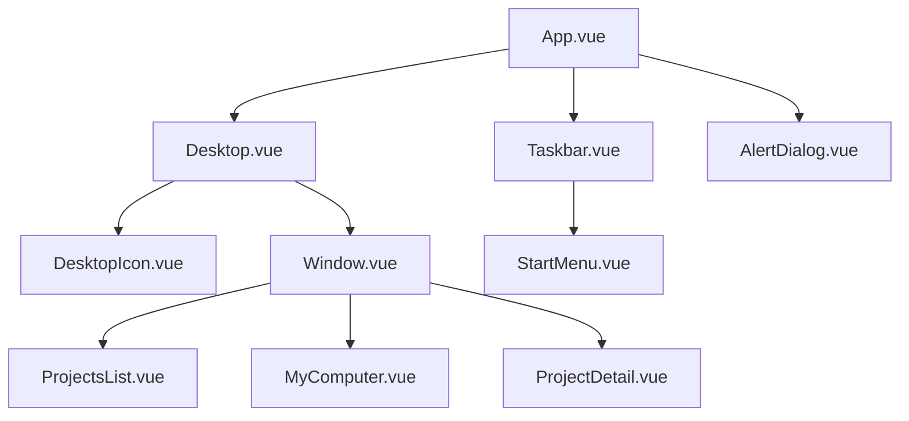

# Spécifications de Conception : Portfolio Rétro Windows XP

Ce document présente l'architecture globale, la gestion d'état et le plan de composants pour le portfolio interactif Windows XP.

## 1. Synthèse de compréhension

* **Quoi :** Site portfolio interactif émulant l'interface d'un bureau Windows XP.
* **Pourquoi :** Présenter les compétences, projets et parcours de Thomas de façon créative, nostalgique et ludique.
* **Pour qui :** Recruteurs, clients et passionnés de design web rétro.
* **Technologies :** Vue 3 (Composition API), TailwindCSS v4, XP.css (Design System).
* **Éléments interactifs initiaux :** 
  * Bureau dynamique (fonds d'écran, icônes, sélection).
  * Dossier **"Mes Projets"** (liste interactive des réalisations).
  * **"Poste de Travail"** (navigation principale pour les compétences et le parcours).
  * Barre des tâches Windows XP fonctionnelle (menu démarrer, réduction/restauration de fenêtres, horloge).

## 2. Hypothèses et Contraintes Non-Fonctionnelles

* **Performance :** Application statique optimisée. Pas d'appels API lourds, les données sont servies localement.
* **Maintenance :** La liste des projets et compétences est centralisée dans un fichier `portfolio.json`.
* **Icônes :** Utilisation d'images PNG authentiques de Windows XP stockées localement dans `/src/assets/icons/` pour garantir une fidélité visuelle absolue.
* **Responsive (Mobile) :** 
  * Écran $\ge 768\text{px}$ : Mode bureau fenêtré avec fenêtres déplaçables.
  * Écran $< 768\text{px}$ : Mode plein écran automatique pour toutes les fenêtres ouvertes afin d'assurer l'accessibilité sur téléphone portable.

## 3. Architecture globale & Gestion d'état

L'application utilisera un store ou un état réactif centralisé pour piloter le comportement du bureau virtuel.

### Schéma de données d'une fenêtre (`WindowInstance`)

Chaque fenêtre ouverte sur le bureau est modélisée par l'objet suivant :

```typescript
interface WindowInstance {
  id: string;            // Identifiant unique ('projects', 'computer', etc.)
  title: string;         // Titre de la barre de titre
  isOpen: boolean;       // Visibilité sur le bureau
  isMinimized: boolean;  // Réduite dans la barre des tâches
  isMaximized: boolean;  // En plein écran
  zIndex: number;        // Position de superposition
  x: number;             // Position X sur le bureau (px)
  y: number;             // Position Y sur le bureau (px)
  width: number;         // Largeur d'origine (px)
  height: number;        // Hauteur d'origine (px)
}
```

### Gestion du focus et du Z-Index

* Un compteur réactif `currentMaxZIndex` est incrémenté à chaque clic sur une fenêtre ou icône.
* La fenêtre cliquée reçoit cette valeur maximale, la plaçant instantanément au premier plan.
* En cas de débordement important (ex: $> 1000$), une fonction de nettoyage réindexe les fenêtres actives de $1$ à $N$ pour conserver la cohérence logique.

---

## 4. Structure des composants



### Mécanisme du Drag & Drop (`Window.vue`)

1. L'événement `mousedown` sur la barre de titre enregistre les coordonnées initiales du curseur et la position `(x, y)` actuelle de la fenêtre.
2. Deux écouteurs d'événements temporaires sont attachés au document global : `mousemove` et `mouseup`.
3. Durant le mouvement (`mousemove`), nous calculons le décalage de la souris et l'appliquons aux variables réactives de position de la fenêtre.
4. Lors du relâchement (`mouseup`), les écouteurs globaux sont détachés pour libérer la mémoire.

---

## 5. Journal des décisions

| Décision | Choix retenu | Alternatives envisagées | Rationale |
| :--- | :--- | :--- | :--- |
| **Design System** | `XP.css` | `98.css` | Volonté expresse d'avoir le style bleu/vert Luna de Windows XP. |
| **Icônes** | PNGs locaux Windows XP | Lucide-icons, Emojis | Fidélité visuelle maximale à l'époque Windows XP. |
| **Navigation** | État réactif (Option 1) | Vue Router | Permet le multi-fenêtrage et le glisser-déplacer simultané. |
| **Données** | Fichier JSON local | Markdown séparé | Structure de données claire, centralisée et facile à modifier. |
| **Alertes système** | `AlertDialog.vue` | `window.alert()` natif | Remplacement de la boîte système par une modale custom fidèle au design XP pour ne pas rompre l'immersion rétro. |
